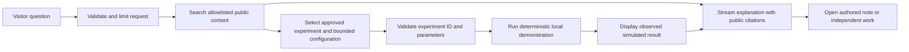

# Animesh Basak — Built over time

Revised portfolio concept · 12 September 2026 · Draft for review

This is the current proposal. It supersedes The Living Blueprint's employer-centered demonstrations and its employer metrics. The website has not yet been rebuilt. This document describes proposed behavior, not completed features or legal clearance.

The novelty research is recorded in [Change one thing — research and interaction brief](2026-09-12-change-one-thing.md). The refined signature is a branching experiment that visitors can challenge, with a bounded search for counterexamples. An AI guide and interactive diagrams alone are already represented in existing portfolios.

The [static art-direction mockup](2026-09-12-built-over-time-concept.png) illustrates the personal-journey layers and the initial Studio layout. It predates the counterexample interaction refinement; it does not demonstrate working animation or AI. The [generation prompt](2026-09-12-built-over-time-image-prompt.txt) is retained for reproducibility of the creative brief, not as a guarantee of identical generation.

## Core idea

**Tell the story of how an engineer's thinking develops. Let visitors explore that thinking through original interactive experiments.** Employers provide brief career context. The detailed technical material comes from independently authored, publishable projects and experiments expressly created for this portfolio.

The proposed hero headline is **“Built over time.”** The supporting line is **“An engineer's journey through interfaces, systems, and what comes next.”** Animesh's name and Lead Frontend Engineer role remain immediately visible. The previous headline, “I build what teams build on,” can become a supporting statement in the reusable-systems chapter if Animesh wants it.

The site should feel like a personal exhibition that can be explored: precise typography, warm materials, short authored reflections, selected artifacts, and a continuous visual thread. Its purpose is to show judgment, range, and growth. It does not need access to an employer's internal systems to do so.

## The content boundary

The user explicitly does not want detailed Airtel work disclosed. Apply the same conservative editorial boundary to all employers. There will be no employer-specific architecture demonstrations or reconstructions, even with the names removed. Replacing names, blurring a screenshot, or relabeling an internal system as a conceptual example does not by itself make the underlying information suitable for publication.

The design can reduce disclosure risk, but cannot guarantee that no complaint or legal claim will arise. The user's actual employment agreement, confidentiality obligations, intellectual-property terms, and external-publication policy have not been reviewed. WIPO notes that confidentiality obligations and their scope depend on the applicable circumstances and contracts. For employer-related material with uncertain permission, use broad career facts and seek appropriate company/legal review before publication. [WIPO guidance](https://www.wipo.int/en/web/trade-secrets/protection).

| Material | Proposed treatment |
|---|---|
| Employer name, role, employment dates | Brief plain-text career record using accurate facts permitted for public disclosure. No implied employer endorsement. |
| Broad responsibilities and general skills | Short descriptions, such as “Frontend engineering and technical leadership,” subject to the same publication boundary. |
| Internal names, schemas, services, diagrams, release processes, incidents, roadmaps, or team structure | Exclude from public portfolio material and the AI collection. |
| Employer screenshots, source code, logs, tickets, analytics, or product configurations | Exclude. Do not recreate them from memory for an exhibit. |
| Employer business outcomes, platform metrics, or unpublished performance data | Omit from this design. Public availability alone does not establish permission to claim personal ownership or reuse assets. |
| General engineering principles | Explain in original words with independent examples, without revealing a specific employer's implementation. |
| Independent projects and open-source contributions | Detailed demonstrations only after confirming publication/ownership rights and removing secrets or third-party restricted material. A public repository or work done outside office hours is not automatic clearance. |
| Personal reflections | Use Animesh's own approved account. Do not invent formative incidents, quotations, opinions, or company-specific anecdotes. |
| Resume and existing writing | Prepare an explicitly public version. The detailed PDF provided for analysis is not automatically a public-download or AI-ingestion source. |

This boundary is for content selection, not prominent website copy. Visitors should encounter a confident personal portfolio, not a page dominated by compliance language. Label independent demonstrations naturally as “Portfolio experiment” or “Interactive demo.”

## The signature: one thread, five chapters

One indigo thread evolves through five translucent paper-like layers. Initially it is a point and a line. As the visitor advances, it becomes an interface outline, a reusable component family, a decision path, and finally an index of independent experiments. Earlier forms remain faintly visible underneath, showing accumulated understanding.

The thread represents learning; the layers are chapters in the story. They are not an actual employer architecture, a reconstruction of a commercial product, or a claim that a particular company taught one particular lesson. Dates and career roles appear in a separate, restrained chronology. The chapter labels below are an editorial proposal that Animesh can personalize.

| Chapter | Proposed theme | Original demonstration | Personal content to author |
|---|---|---|---|
| **01 — Make it work** | Discovering the feedback loop between intention and a working interaction | A simple control changes a small piece of the exhibition | A truthful short reflection about beginning to build |
| **02 — Make it clear** | Caring about people using the interface | Compare ambiguous and explicit feedback; explore keyboard/focus behavior | A general lesson about clarity, without a company incident |
| **03 — Make it reusable** | Moving from a screen to a system | One token or component setting updates two original interface examples | Why reusable contracts matter to Animesh |
| **04 — Make decisions** | Balancing constraints and helping other engineers | Change reliability or interaction constraints in a small local simulation | An authored principle about trade-offs and technical leadership |
| **05 — Explore what comes next** | Applying engineering judgment to AI | Open Proof Studio and inspect a real public independent project | Current questions and experiments, clearly distinguished from completed work |

Each chapter combines a small interaction, 60–100 words of personal writing, and an optional evidence link. A gallery of repeated abstract objects would be too generic; the meaning comes from Animesh's own observations and the useful behavior of the experiments. The experiments illustrate current skills. They should not imply that newly built demos are historical artifacts.

## Scroll and parallax choreography

Desktop uses native vertical scrolling. In one bounded opening sequence, a sticky scene turns and separates the leaves at different depths. The foreground travels more than the background. A single thread remains aligned across the layers, providing spatial continuity. Each chapter has a stable readable state and an ordinary anchor that can be reached directly.

Start by testing roughly 180–220vh total for the opening exhibit, including the viewport occupied by the scene, rather than pinning the entire five-chapter page. Follow it with normal document sections. The original object can reappear as a small chapter marker; it does not need to remain a full-screen animation through the whole site. Final scroll distance depends on in-browser comprehension testing.

| Interaction | Proposed behavior |
|---|---|
| Initial load | Name, role, headline, navigation, and actions render immediately. A composed static illustration precedes motion enhancement. |
| Scroll through opening | Layers separate and the thread develops continuously. Labels change at stable checkpoints. |
| Select chapter | Normal anchor navigation or explicit state selection; do not let scroll and click controllers fight over state. |
| Explore experiment | Suspend ambient motion in that region while the visitor interacts or types. |
| Continue reading | Resume ordinary document flow; no mandatory horizontal scrolling or repeated full-screen gates. |
| Mobile | Compact front-facing stack, explicit chapter buttons, native scrolling, and inline experiments. |
| Reduced motion | Stable chapter illustrations and instant state selection; preserve all content and controls. |

Keep the native pointer. No interaction should require hover, dragging, learning game controls, or waiting through an intro. Keep work, resume, and contact reachable throughout.

## The intelligence: Proof Studio — Change one thing

**“Ask a question. Try the answer.”** A visitor asks what they want to understand about Animesh's engineering. The portfolio selects an original interactive experiment, explains what to try, and points to relevant approved writing or independent work. The AI's useful output includes something the visitor can operate.

Research found existing portfolios with contextual AI, architecture comparison, and flow simulations. Interactive explanations and AI-assisted controlled experiments also have precedents. The distinction therefore needs to be more specific: **a visitor can change a requirement, branch a design, and ask the site to find where its current recommendation fails.** The spatial journey becomes a record of tested choices rather than merely a sequence of animated project descriptions.

The Studio offers **“Change one thing”**, **“Find where this fails”**, and **“Replay this result.”** These are ordinary buttons as well as optional natural-language intents. A fixed experiment engine runs valid configurations and returns observations. The AI helps clarify the visitor's goal, proposes one bounded change, and explains the resulting evidence. It cannot award itself a success, invent a measurement, or claim that an unsuccessful bounded search proves a design always works.

The layer illustration and the experiment share state. A branch draws a second thread through the leaves; selecting a replay highlights the layer where a decision changed behavior. Desktop can interpolate the separation; mobile and reduced-motion modes show two stable states. The main navigation and factual career timeline remain stable. This synthesis is the proposed signature, with its precedents and research limits documented in the companion brief.

### Example visitor journey

The visitor types **“Show me how you design for unreliable networks.”** The AI selects the prebuilt delivery experiment and opens it in the exhibition. Two implementations process the same synthetic stream: Direct save and Save with bounded retry. The visitor changes simulated failure rate and tries saving a fictional note.

Both implementations use the same seeded failure conditions and action sequence. The view shows local simulated attempts, outcomes, and duplicate handling. Success is not guaranteed: persistent simulated failure remains a visible failure. The AI explains the actual result and trade-off from structured experiment data and a prepared teaching note; it does not invent production metrics or claim the simulation proves production scalability.

The visitor can then choose “Why this design?” to read an authored note, or “Related work” to open a publishable independent project. A quiet journey marker highlights the decision-making chapter. The visitor can close the Studio without losing their reading position.

A second, more distinctive step is **“Find where this fails.”** For the delivery experiment, the engine can test a finite collection of declared failure traces: persistent offline, a lost acknowledgement after a successful save, and retries that exceed the selected waiting budget. It returns a concrete replay and the violated requirement, if one is found. All failure traces are synthetic. Both alternatives must expose pending/unknown states honestly; a deliberately incomplete teaching baseline is labeled as such, never presented as Animesh's historical production code.

For a clearer first comparison between two valid designs, the recommended lead experiment is now an original **reading board with cache-first and network-first views**. The visitor varies response delay, acceptable data age, and whether the fictional source has changed. This makes speed versus freshness visible without requiring access to any employer system. Its exact requirements, search limits, and failure outcomes are described in the companion brief. The delivery demonstration remains a later experiment and the subject of the static art-direction mockup.

### First release experiment set

| Visitor intent | Experiment | What it can demonstrate |
|---|---|---|
| “Can it feel instant and stay current?” | Original reading board; cache-first and network-first views under synthetic changes | A visitor-defined goal, two valid alternatives, a replayable counterexample, and an honest unsatisfied-constraints outcome |
| “How do you handle failure?” | Seeded synthetic delivery with bounded retries and duplicate handling | Failure states, explicit feedback, and a reasoned reliability trade-off |
| “How do you make interfaces reusable?” | One component contract updates two original screens | Reuse, validation, and consistency without showing any employer code |
| “How do you think about accessibility?” | Original keyboard/focus and validation-feedback example | Specific observable interaction behavior; not a claim of complete accessibility certification |

Prove one experiment end to end before building all three. If an input does not match an available experiment, say “I don't have an interactive example for that yet” and offer relevant approved material. Do not quietly substitute an unrelated demonstration or improvise executable code.

### Intelligence without invented autobiography

The assistant can summarize approved facts about roles and independent projects. It can explain general techniques and the synthetic experiments. It must distinguish **“Animesh's published note”** from **“AI explanation”** and **“Simulated result.”** It should not present generated reasoning as Animesh's historical thinking or as something used at an employer.

A visitor may ask, “How has your thinking changed?” The response should retrieve actual authored before/after reflections. Until these are written and approved, the system should explain the proposed chapter themes without claiming personal events. Never fabricate an earlier-self persona or claim to expose private thought processes.

## AI and content architecture

Keep Next.js and the existing Motion/MDX foundation. Use a server endpoint for model calls and retrieval. Return validated typed UI descriptions through a supported AI SDK; use text streaming only where the chosen provider/mode supports it. The client renders a fixed registry of trusted experiment components. Model output is data: selected experiment ID, bounded configuration, explanation, and allowed source IDs. It is never arbitrary executable JavaScript, JSX, shell commands, or raw HTML. [AI SDK generative UI](https://ai-sdk.dev/docs/ai-sdk-ui/generative-user-interfaces).

Add a small deterministic comparison and counterexample-search module for each experiment. Both alternatives receive the same immutable scenario, seed, virtual event timeline, and explicit visitor requirements. Search only the declared finite scenario set. Return the failing predicate and replay trace, or “No counterexample found in these tested scenarios.” Pin engine/content versions in replay data. Keep replay state local or encode only validated synthetic configuration; raw questions and personal text are excluded. The implementation must distinguish a visitor-selected criterion from a universal claim that one architecture is better.

Use a separate explicit allowlist, proposed as `content/public-portfolio/`, for the assistant's source material. Do not recursively index this repository, the design documents, old resumes, local files, private notes, employer material, or all existing blog posts. Build a public-content manifest with source IDs, review dates, publication rights/status, and approved excerpt text. The user-supplied detailed resume remains analysis input until a separate public version is selected.

Only published/approved records enter the deployed retrieval artifact. The assistant has no tools or credentials for private files, employer systems, email, local code execution, or unrestricted web browsing. For questions about employer implementation, it can say, “I can discuss broad experience and show an independent example, but I don't have internal employer material.” This behavior rests on lack of access as well as instructions; prompts alone are not a confidentiality boundary.

The site itself should use the same approved content records for role summaries and project facts. Index updates require explicit record selection. Remove a source from both display and retrieval when permission or status changes; retain a content version so stale AI results can be invalidated.

### Existing hosting and free API proposal — 12 September 2026

The user confirmed that the portfolio is already live at **animeshbasak.com on Vercel**. Reuse that domain and deployment. The proposed AI endpoint runs on Vercel and calls external inference APIs; Cloudflare would be an inference supplier via its [REST API](https://developers.cloudflare.com/workers-ai/get-started/rest-api/), not a website-hosting migration. Actual Vercel plan allowances and existing usage still need checking before deployment.

Recommended candidate chain: **Groq Free → Cloudflare Workers AI Free → authored explanations and local experiments**. Keep this a zero-paid-inference configuration: only permit models available on the selected free plans, and stop making remote calls when allowances are exhausted. Free service capacity and policies can change. This proposal does not promise uninterrupted generative AI, and neither provider has been connected or benchmarked for this portfolio yet.

Groq's published free limits for `openai/gpt-oss-20b` are 30 requests/minute, 1,000 requests/day, 8,000 tokens/minute, and 200,000 tokens/day; actual organization limits can differ. At an illustrative 2,500 counted tokens per call, the daily token allowance supports about 80 calls before other limits, not 1,000 full conversations. The model supports strict structured output, but Groq currently documents that structured outputs cannot be combined with streaming or tool use. Start with one compact, validated response; local experiment events need no model call. An optional later explanation call counts separately. [Groq limits](https://console.groq.com/docs/rate-limits), [structured outputs](https://console.groq.com/docs/structured-outputs).

Cloudflare Workers AI offers 10,000 Neurons of inference per day on Workers Free. This is a compute allowance, not a fixed message count. Use a model available on the free plan, initially evaluating an economical instruction model such as `@cf/meta/llama-3.1-8b-instruct-fp8-fast`; some larger models require paid billing. Validate its response with the same application schema and decline unsupported output. [Cloudflare pricing](https://developers.cloudflare.com/workers-ai/platform/pricing/).

Fail over on a transient network/server failure, timeout, or provider quota error. Respect retry headers, mark an exhausted provider unavailable until an appropriate retry time, and set one overall response deadline. Permit at most one backup-provider attempt. Do not retry forbidden content elsewhere to bypass a refusal, and do not combine partial answers from different providers. Stop remote requests when the visitor cancels. Use a shared quota/circuit state suitable for serverless execution, whose own free allowance must be verified; an in-memory counter in a Vercel instance is not a global limit.

Serve approved common explanations locally, keep retrieved context small, bound billed output including reasoning, and use explicit question submissions rather than model calls on scroll or every slider update. A fully local fallback should say “Explore the guided examples” and present authored notes plus working controls. It must not masquerade as a live AI response. Test outage, quota exhaustion, slow response, cancellation, malformed output, and absent credentials before launch.

Enable Groq's optional Zero Data Retention setting and avoid persistence features. Cloudflare states it does not use Workers AI customer content for training or service improvement without explicit consent. Visitor notice should identify both external inference providers; fallback still transmits the question to another service. Only approved public excerpts and necessary synthetic experiment state are supplied. [Groq data controls](https://console.groq.com/docs/your-data), [Cloudflare data usage](https://developers.cloudflare.com/workers-ai/platform/data-usage/).

OpenRouter's free models are a possible later alternative, with a published 50 free requests/day allowance without qualifying credit purchases and provider-specific policies; they are not required for the initial chain. Gemini's unpaid service terms permit product-improvement use and human review of submissions, and require Paid Services for API clients made available to EEA, Switzerland, or UK users. These make the unpaid Gemini tier a poor default for this proposed global public portfolio. [OpenRouter FAQ](https://openrouter.ai/docs/faq), [Gemini terms](https://ai.google.dev/gemini-api/terms).

### Operation and failure states

- Run no model call merely because a visitor scrolls or hovers. Questions and explicit Studio actions trigger inference.
- Bound request length, conversation length, response length, model steps, experiment parameters, timeouts, and spend. Use a shared rate-limit store in production.
- Execute examples locally against synthetic data. Keep real contact and email actions outside the assistant's toolset.
- Display experiment results directly from deterministic state, not model-written numbers. If the AI explains those results, send only the necessary synthetic state to the server.
- Validate citation IDs and experiment IDs. Unsupported IDs cannot create links or instantiate components.
- On model outage, show the same experiment gallery with pre-authored descriptions labeled as such. The portfolio remains usable.
- Keep credentials server-side. Do not log raw questions by default; document any future retention choice.
- Support stop/retry, stable focus, Escape to close modal presentation, and screen-reader announcements at response-segment boundaries.

## Page structure

1. **Built over time:** immediate identity and the layered signature, with direct Journey / Experiments / Resume actions.
2. **The journey:** five short chapters of original reflection and optional mini-experiments. A compact employer chronology supplies context without revealing operational detail.
3. **Proof Studio:** the flagship intelligence feature. Also reachable from the header and chapter prompts.
4. **Independent work:** two or three substantial, publishable projects. Lakshya and SuperAgent are candidates, pending current status and rights review. Use actual permitted screenshots and links, not inferred test counts or generated product screenshots.
5. **Notes:** selected writing that is suitable for public display. Review the existing collection rather than importing everything automatically.
6. **The person:** a real portrait, interests, and the kind of engineering Animesh wants to do next, in his own words.
7. **Contact:** concise role interests, permitted public contact links, and a reviewed public resume.

Career entries can use a format such as **“Airtel Digital · Lead Engineer · 2025–present”**, followed by one broad permitted sentence. Detailed employer case studies, internal project names, squad counts, and business metrics are not requirements of this proposal.

## Art direction

Warm paper `#EEEAE3`, near-black `#171C26`, and indigo `#354DCB`. One small vermilion punctuation mark may provide an accent. The mockup explores a high-contrast editorial serif for the headline with a clean sans-serif for controls and small labels. Limit the implementation to those two families, with generous reading measure, thin editorial rules, and carefully composed original imagery. Exact fonts and all color pairs will be verified during implementation.

The centerpiece resembles a sculptural notebook: translucent leaves, restrained shadows, and one continuous indigo thread. It references accumulation and learning. The interactive experiments use the same geometry and typography, so the AI Studio belongs to the exhibition rather than appearing as a third-party widget. Essential labels remain DOM text even if a scoped 3D renderer is used.

## Verification and production order

First author and select the public content. Then prototype the thread/layer sequence and one Proof Studio experiment. Demonstrate both on a laptop and phone before expanding the site. The latest static mockup can establish art direction, but it cannot prove the parallax, the model, or experiment behavior.

Acceptance checks for implementation:

- A visitor can identify Animesh's role, find independent work, and reach contact/resume without completing the journey or asking AI.
- The opening contains no employer operations, metrics, diagrams, or reconstructed screens. Public content and retrieval manifest are explicitly selected; private source documents are absent from the deployed index.
- A factual response is supported by approved sources. An explanation is labeled as AI-generated when appropriate. No invented employer details or personal stories pass the release evaluation set.
- A request for internal employer details cannot access anything outside the public collection. Test direct requests, instruction injection, invalid source IDs, and attempts to select unavailable tools.
- An experiment's outcomes match its deterministic state across seeds and settings. Invalid parameters are rejected, persistent failure stays visible, and display does not rely on model-generated measurements.
- Native navigation, mobile touch, keyboard, 200% zoom, and reduced-motion behavior work. At 360/390px, text and controls remain readable and the virtual keyboard does not obscure Studio actions.
- Production performance is measured: aim for LCP ≤2.5s, INP ≤200ms, CLS ≤0.1 at the 75th percentile after real field data exists. Use lab tests and frame profiling before launch, without presenting them as field results. [Core Web Vitals](https://web.dev/articles/vitals).

The testable first milestone is one chapter, one original experiment, and one grounded AI response leading to that experiment. It gives a concrete basis for judging originality, usefulness, disclosure boundaries, and motion quality before the rest of the portfolio is produced.

## Current-site follow-up

This revised draft does not make the existing live content compliant. The current homepage, blog posts, metadata, social images, and downloadable resumes require a separate content pass against the chosen public boundaries before republishing. Existing public material should not be assumed approved merely because it is already online. No such edits or removals have been performed as part of this design revision.

The earlier draft and image are retained as superseded working material, not recommended publication assets or AI sources. The current proposal retains layered parallax, changes the story to personal growth, and adds Proof Studio as the central intelligence feature.
