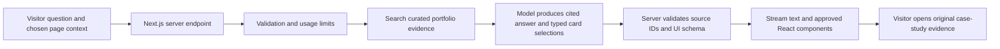

# Animesh Basak — The Living Blueprint

Design proposal · 12 September 2026 · Status: SUPERSEDED — internal working material

**Do not implement or publish this direction as written.** The user has requested a personal engineering journey without detailed employer disclosures. The current proposal is [Built over time](2026-09-12-built-over-time.md), including the Proof Studio intelligence feature. Employer examples, metrics, the old visual, and raw resume ingestion in this earlier draft are not approved public content. Keep this document out of any AI retrieval index.

Companion visual: [Desktop art-direction draft](2026-09-12-living-blueprint-concept.png). Generated with the built-in image-generation tool and visually reviewed. It illustrates composition and material language; the generic interface and fine diagram labels are placeholders for a real, public-safe demonstration. The supplied resume is [Animesh_Basak_Resume_2026_Refined.pdf](</Users/animeshbasak/Library/Mobile Documents/com~apple~CloudDocs/Resume/Animesh_Basak_Resume_2026_Refined.pdf>).

## Recommendation

Build an editorial portfolio around a working demonstration of frontend platform engineering: **a finished interface can be opened into the components, schema, and decisions that make it possible.** Carry that same interaction into selected case studies and into an AI guide that assembles cited evidence in response to a visitor's question.

The public headline is **“I build what teams build on.”** The role line is **“Lead Frontend Engineer · Platforms, interfaces & AI.”** The supporting sentence is “I build shared frontend platforms and thoughtful web and native experiences. Currently building frontend platforms at Airtel Digital and leading a 5–7 engineer squad.” This is proposed copy, grounded in the supplied resume; it is not an assertion of a new job title.

Working audience assumption: hiring leaders evaluating Lead/Staff frontend and platform roles, with collaborators and AI consulting prospects as a secondary audience. The user was asked for audience preference; this draft proceeds from the resume's explicit positioning while that preference remains open.

## What the review found

I read and visually inspected the complete one-page refined resume, inspected the running homepage, and reviewed the active code through a separate read-only audit. The active site is the `app/(v6)` experience, not the particle/radar presentation under `/legacy`. This is a qualitative design and source audit; no production Lighthouse, field-performance, or assistive-technology audit was run.

The resume's strongest differentiator is shared schema-driven frontend infrastructure: BEFE schemas, reusable widgets, design systems, React Native conversational journeys, architecture sign-off, and production review across a squad of 5–7 engineers. Backend work and independent AI products support that identity. The portfolio should make this work understandable and memorable rather than burying it inside a chronological role accordion.

| Current observation | Design implication |
|---|---|
| Strong, oversized typography and consistent warm paper/orange palette | Preserve confidence and editorial restraint; introduce a visual language belonging to the actual work. |
| Hero and SEO say Senior Frontend Engineer; refined resume says Lead Frontend Engineer; older writing argues for full-stack positioning | Establish one current identity across headline, metadata, resume, biography, and AI corpus. Keep older writing dated and contextualized. |
| Resume describes shared platforms and schema-driven interfaces in much greater depth than homepage | Put platform engineering above the employment chronology. |
| Project cards are text-only; repository has no substantive screenshots, videos, portraits, or 3D assets | Invest in original product evidence and diagrams. Asset direction is a core workstream. |
| Navigation exposes LEGACY / V6 and an accent picker | Give header space to Work, Approach, Writing, Resume, and Contact; move experiments into an intentional archive. |
| Timed preloader takes roughly 2.1 seconds from its configured timers | Show meaningful content immediately; reveal the signature scene after the first useful paint. |
| Several perpetual requestAnimationFrame loops run on the active homepage | Define animation ownership and stop work when offscreen, idle, or hidden. This is a code-level risk, not measured dropped frames. |
| Desktop reduced-motion exits custom-cursor JS, while global CSS still hides the native cursor | Restore the standard pointer and design an explicit reduced-motion experience. |
| Section navigation disappears on smaller widths without an equivalent menu | Include a mobile menu and direct access to work, resume, and contact. |
| Some text begins at very low opacity and metrics begin at zero | Render meaningful content in HTML; movement enhances already readable content. |

Relevant source references: `components/Hero/Hero.tsx:71`, `app/layout.tsx:8`, `components/Lab/Lab.tsx:17`, `components/Chrome/Preloader.tsx:32`, `components/Cursor/Cursor.tsx:17`, `app/globals.css:66`, `components/Nav/Nav.module.css:111`, `components/Dossier/Dossier.tsx:83`.

### Content that needs reconciliation

- The active `/resume.pdf` download differs from both the supplied refined PDF and the other PDF in `public/`. Pick the refined document as the intended current source, then update the published download during implementation.
- Lakshya is described as having 98 tests in the refined resume and 290 tests on the homepage. Neither count was independently reproduced. Use a dated, reproducible number or omit the count.
- SuperAgent / PAARTH naming and project status differ across the resume, project cards, and writing. Establish current names and link historical names explicitly.
- MakeMyTrip's “Lighthouse 6 → 8–9” has an unclear scale in both sources. Do not silently convert it to 60 → 80–90. Use a qualitative performance claim until the measurement is clarified.
- “150M+ MAU” describes the Airtel Thanks platform context in the resume. It should not imply Animesh alone built the whole platform or that every individual journey served 150 million people.
- Preserve the resume's attribution on Paytm: work **contributed to** a 40% increase in device sales. Avoid presenting a complex business outcome as an individually proven causal result.

## Award reference research

Awwwards score pages weight Design 40%, Usability 30%, Creativity 20%, and Content 10%. Developer evaluation additionally exposes accessibility, performance, semantics, responsiveness, and animation categories. An original interaction needs an equally convincing reading experience. A nomination is an approved submission status, distinct from winning an award; this proposal cannot guarantee either outcome. [Official scoring example](https://www.awwwards.com/sites/lusion-v3), [submission FAQ](https://www.awwwards.com/faqs/).

| Verified reference | Useful lesson | Application here |
|---|---|---|
| [Igloo Inc](https://www.awwwards.com/sites/igloo-inc), SOTD 23 July 2024 | Its material and interaction language belongs to its identity. The creators prototyped in grayscale and revised repeated objects that made projects hard to distinguish. | Make the interface/schema transformation belong to platform engineering, and give each case study a distinct real problem. [Creator breakdown](https://www.awwwards.com/igloo-inc-case-study.html) |
| [Lusion v3](https://www.awwwards.com/sites/lusion-v3), SOTD 2 October 2023 | The portfolio itself demonstrates creative engineering, while project navigation remains recognizable. | Demonstrate craft through the signature interaction; keep reading, links, and navigation conventional and usable. |
| [Lando Norris by OFF+BRAND](https://www.itsoffbrand.com/our-work/lando-norris) | Motion expresses the subject's personality. | Express assembly, reuse, and controlled change; racing imagery, lime accents, and helmet reveals would not express Animesh's work. |
| [Bruno Simon](https://bruno-simon.com/), with [published implementation](https://github.com/brunosimon/folio-2025) | Visitors use a demonstration of the creator's actual specialty. | Let visitors operate a small frontend system and query its evidence. Direct access to work must remain available. |

These are transferable design principles, not evidence that copying a technique produces an award. External performance was not independently measured in this review.

## Three possible directions

| Direction | Experience | Trade-off |
|---|---|---|
| **The Living Blueprint — recommended** | Warm editorial pages; a product interface opens into its system; AI composes an evidence trail using the same component grammar. | Most specific to the resume and strongest integration of design and AI. Requires a convincing functional demo, not just floating planes. |
| Field Notes at Scale | A refined engineering journal with annotated screenshots, thoughtful typography, diagrams, and exceptionally good case studies. | Fastest route to a credible hiring portfolio; less immediately memorable as an interactive submission. |
| The Scale Observatory | Dark spatial model of products, journeys, and dependencies, explored through a central canvas. | More cinematic, but can misrepresent the specialty and make reading/navigation harder. Carries more asset and performance work. |

The Living Blueprint earns its complexity by showing how Animesh thinks. The final visual work should resemble a beautifully typeset architecture publication with a working exhibit, not a developer dashboard.

## Visual direction

**Palette:** warm paper `#F2F0E9`, ink `#101820`, cobalt `#233EDE`, and a sparingly used vermilion registration mark. Cobalt carries selected states and the structural exhibit. Color has a fixed meaning rather than being a visitor-selectable theme. All actual text/background pairs require measured contrast before release.

**Typography:** one carefully tuned variable grotesk for display and reading, with a restrained monospace for labels. Start by testing the project's existing fonts. An open-source pairing candidate is Archivo with IBM Plex Mono; check the exact distributed font licenses before packaging. Use sentence case in headlines, large but readable display type, 16–18px body text, and comfortable reading measure. Desktop display scale approximately 88–120px; mobile 44–60px, tuned to content rather than fixed blindly.

**Composition:** 12-column desktop grid, generous outer gutters, asymmetric hero, 4-column mobile grid. Fine rules organize sections. Broad editorial image panels replace repeated rounded cards. Use cobalt expanses selectively to create chapter changes. Keep technical micro-labels secondary, with no essential copy hidden in tiny callouts.

**Imagery:** an original generic interface and its schematic layers establish the signature. Case studies use actual permitted product imagery or clearly labeled sanitized reconstructions. Include a real portrait and a brief personal passage lower on the page to make the portfolio human. Never invent an image of Animesh, employer screenshots, dashboards, testimonials, or telemetry.

## The signature: open the interface

The hero begins with a finished interface. A visible **“See the system”** control separates it into three aligned planes: Interface → Components → Schema. A slim connector follows one selected element through all three layers. Beside the scene, a short explanation states the decision being demonstrated and links to the related case study.

**Scroll-driven option, clarified after the user's parallax question:** on desktop, native scroll through one short sticky exhibit can drive the same layer separation continuously. The interface moves closest to the viewer, the component plane travels a smaller distance, and the schema plane anchors the composition. Connectors remain aligned; labels appear at distinct checkpoints. Use a bounded sequence of roughly one additional viewport, then return to ordinary document flow. This is proposed behavior, not an implemented animation. The Interface/System buttons remain an equivalent direct control. Activating a button takes ownership of the exhibit state until the visitor explicitly returns it to scroll control, so scrolling cannot immediately override the selected view. Mobile and reduced-motion visitors use the stable tap/button states described below.

The exhibit must do something real. A small, pre-authored example lets a visitor change a journey requirement, such as switching from a short form to a guided sequence. The same validated schema changes the rendered components. The transition shows which components are reused and which state changes. This is a portfolio-owned demonstration of a pattern, labeled as such; it is not a reconstruction of confidential Airtel internals.

The memorable description should be: **“His portfolio lets you change the interface and see the system behind it.”** The exploded visual is a means of explanation. The actual behavior and linked decision give it substance.

The first production exhibit should follow one publishable decision through one complete case study. Select that decision from verified project material before final asset production. If no employer example is publishable, demonstrate the same documented pattern in an original portfolio-owned example and label it explicitly. Do not let generic planes become the final content.

### Interaction storyboard

| State | Visitor sees / does | Motion and meaning |
|---|---|---|
| Arrive | Name, role, headline, work CTA, resume, and the finished interface are visible | Brief settling motion after content is readable; no blocking intro. |
| Inspect | Activates See the system | Planes separate over approximately 650–850ms; the selected component remains visually traceable. |
| Change | Chooses a predefined journey variation | The schema changes, corresponding widgets update, and a compact before/after explanation appears. |
| Understand | Opens the related decision | A short note explains constraint, trade-off, and production relevance; a normal link opens the full case study. |
| Ask | Asks for evidence of platform experience | The AI returns source-linked work cards inside the same visual system. It does not spontaneously interrupt reading. |
| Continue | Scrolls to selected work | The connecting motif becomes a quiet section marker; normal document flow continues. |

Pointer tilt is optional and limited to about 2 degrees inside the exhibit. The native cursor remains visible. There is no mandatory dragging, no full-page horizontal scrolling, and no dependence on completing the exhibit to reach the work.

### Equivalent experiences

- **Mobile:** retain the same Interface/System control, switch to a front-facing stacked view, and show each layer's explanation below it. Use tap targets of at least 44px. Keep page scrolling native and reserve scene height to prevent layout jumps.
- **Keyboard:** ordinary buttons select mode, journey, and component. Focus remains predictable; selected state is exposed semantically. Links open the same cases as pointer interaction.
- **Reduced motion:** swap between stable layouts without spatial travel. All explanations and example changes remain available. Keep the native pointer and readable initial content.
- **JavaScript disabled or enhancement failure:** deliver the finished interface illustration, explanatory text, case-study links, resume, and contact in HTML. No blank masks or zeroed metrics.
- **WebGL unavailable:** the proposed first version works in DOM/CSS. If optional WebGL is later justified, preserve that DOM version as the fallback.

## Page and content structure

1. **Opening — what you build.** Name, Lead Frontend role, headline, short context, interface exhibit, direct work and resume actions. Within seconds, visitors should understand both specialty and current employment.
2. **Selected work — proof before biography.** Feature three substantial case studies: shared frontend platforms at Airtel, performance/reliability at MakeMyTrip, and a working independent AI product such as Lakshya. Add Paytm migration and SuperAgent as secondary work if evidence is ready. The initial selection is editorial, not a claim that these cases are already documented.
3. **How I make systems usable.** A short principle-led section built from actual decisions: reusable contracts, configurable journeys, measured performance, and production safety. Reuse the exhibit's language rather than introducing another large effect.
4. **Independent builds.** Show real product clips, exact current status, a useful technical decision, and an inspectable link. Distinguish live products from plans or experiments.
5. **Experience and person.** Compact career chronology, a real portrait, and a short personal statement. Professional history reinforces the case studies rather than leading the whole page.
6. **Writing.** Three curated articles with useful summaries; a direct link to the complete archive. Reconcile the older positioning post with current identity.
7. **Contact.** Clear role interests, location/remote preference, email, LinkedIn, GitHub, and current resume. Any availability or response-time promise must be current and approved.

Each case-study route opens with the problem, Animesh's exact role, team context, timeframe, and outcome. It then shows constraints → alternatives → decision → implementation shape → validation → lesson. Put a relevant product artifact beside each explanation. Give claims source IDs and dates, with a public-safe distinction between reported outcomes, measured evidence, and conceptual illustrations.

## Integrated AI: Ask about my work

The assistant is an **AI guide to Animesh's work**, clearly labeled as such. It speaks about documented experience and does not impersonate him or invent personal beliefs. Its compact entry point appears in the header and after relevant case-study material. On desktop, activation opens a docked evidence panel without covering the main reading column. On mobile, it opens a full-height dialog with a clear close control, proper focus handling, and support for the virtual keyboard.

The first release has one measurable job: help a visitor find supporting evidence. Default to a concise answer and at most three cited cards. Broad conversation, job-description analysis, and elaborate comparison layouts can follow after retrieval quality and real visitor use justify them.

### Useful behaviors

| Visitor asks | Response experience |
|---|---|
| “Show me your frontend platform experience.” | A brief cited answer plus relevant Airtel/schema, design-system, and architecture evidence. Selecting a card opens its source section. |
| “Give me a 60-second overview.” | A compact role summary, three evidence-backed strengths, and relevant work/resume links. |
| “How do you build with AI?” | A cited explanation of Lakshya and SuperAgent decisions, separating implemented capability from planned work. |
| “Compare these two projects.” | A constrained side-by-side view of problem, ownership, decisions, and documented outcomes. |
| “What is not demonstrated here?” | An explicit statement of gaps or missing evidence; no attempt to fill them with plausible claims. |

An optional later feature accepts a job description and returns **requirement → documented evidence → unknowns**, not an opaque match percentage or hiring verdict. A notice must explain provider processing before submission; do not retain job descriptions by default. Keep this out of the first release until the core guide is reliable.

### Architecture

Keep Next.js and the current MDX pipeline. Introduce one versioned content source containing roles, projects, claims, dates, source paths, and publication status. Store only material approved for public display in the retrieval index. The refined resume establishes intended positioning, but discrepancies still need explicit editorial resolution. The page and the AI should read the same canonical records.

For this small corpus, begin with deterministic tags and full-text retrieval over curated JSON/MDX, passing only relevant excerpts to the model. Add embeddings only if measured retrieval failures justify them. A vector database, autonomous agent framework, and long-term visitor memory are unnecessary for the first version.

Vercel AI SDK supports streaming chat and mapping tool results into React components. Use it behind a server route, selecting a supported model after testing real portfolio questions for grounding, latency, and cost. The SDK is not currently installed; this design task makes no dependency changes. Pin implementation against current official documentation rather than copying version-specific APIs from this document. [Streaming chat](https://ai-sdk.dev/docs/reference/ai-sdk-ui/use-chat), [generative UI](https://ai-sdk.dev/docs/ai-sdk-ui/generative-user-interfaces).

The model selects from a closed component vocabulary such as `ProjectCard`, `EvidenceQuote`, `ProjectComparison`, and `ContactLink`. It may choose validated source/project IDs and a short explanatory text. It cannot return executable JSX, arbitrary HTML, shell commands, arbitrary URLs, or unrestricted schemas. The server resolves source IDs; the client only renders trusted components. This is a working demonstration of the same schema-driven discipline highlighted in the resume.

Public capability is limited to finding and presenting approved evidence. Email/contact actions remain ordinary visitor-controlled links. Do not connect the existing contact endpoint as an AI tool: its current validation and rate limiting need a separate implementation review.

### Trust, failure, and operation

- Keep provider credentials on the server; validate input size, conversation length, retrieved IDs, and output shape.
- Treat both visitor input and retrieved text as untrusted data. Prompt instructions alone do not prevent injection. Tool boundaries and content permissions enforce what the system can access.
- Add shared server-side usage limits, bounded output/tool steps, timeouts, cancellation, and a configurable monthly budget. Avoid provider calls triggered merely by scrolling.
- Only return document citations that resolve to allowed public source IDs. A valid URL is not proof of entailment: evaluate whether each cited excerpt actually supports its claim.
- On missing evidence, say so. On outage or quota exhaustion, show labeled “Search the portfolio” results and normal resume/contact links. Never disguise scripted content as a live model response.
- Stream visible prose promptly, with Stop and Retry controls. Announce complete response segments to screen readers rather than every token. Restore focus on close and avoid unexpected automatic page navigation.
- Collect minimal aggregate operational metrics: response latency, errors, retrieval failures, usage cost, and evidence-link engagement. Avoid storing raw questions or job descriptions without a defined need and clear notice.

## Motion and implementation strategy

Use the existing React/Next.js and Framer Motion foundation. Assign Motion ownership of component transitions and the first CSS 3D exhibit. Keep native scrolling. Consider GSAP only if the prototype demonstrates a choreography need that is awkward in the existing tools; if added, give it exclusive ownership of the exhibit timeline. Never let two engines animate the same properties.

Begin with real DOM elements, SVG connectors, and CSS perspective. This is sufficient to test whether the idea works. Add a scoped Three.js layer only if lighting, geometry, or material depth creates a clear improvement beyond the DOM prototype. Text, navigation, evidence, and all essential controls remain DOM. No full-site canvas is required to express this concept.

| Motion | Proposed timing | Purpose |
|---|---|---|
| Button and selection feedback | 140–200ms | Immediate response |
| Detail-panel entry/exit | 240–360ms; exit slightly faster | Maintain context |
| Work image transition | 350–500ms | Connect preview to detail |
| Interface/System transformation | 650–850ms | Explain correspondence between layers |
| Text reveal | At most 300–450ms, small displacement | Introduce hierarchy without hiding reading content |

Use transform and opacity for continuous motion. Update per-frame values through refs/Motion values, not React component state. Stop offscreen and hidden-tab animation. The exhibit rests when idle. Reduced motion changes the spatial experience, not access to information. [Motion reduced-motion documentation](https://motion.dev/docs/react-use-reduced-motion).

### Performance and accessibility acceptance targets

- Core Web Vitals at the 75th percentile of real visits: LCP ≤2.5s, INP ≤200ms, CLS ≤0.1. Field data will only be available after deployment; local lab scores are not substitutes. [Official thresholds](https://web.dev/articles/vitals).
- On a production build, target Lighthouse mobile Performance ≥90 and Accessibility ≥95 as regression indicators, paired with manual keyboard, touch, reduced-motion, and screen-reader checks. These are targets, not existing results or guarantees.
- Profile the active exhibit on a representative mid-range phone and laptop. Aim for steady display-rate animation on the laptop; simplify depth before accepting poor input responsiveness on mobile. Inspect frame traces, long tasks, and layout/paint work.
- Establish bundle and asset baselines in the prototype; defer optional 3D and AI panel code. Fonts and the first useful illustration must not wait on provider requests.
- Test 360/390px mobile, tablet, 1440px desktop, and 200% zoom, including long AI answers and the virtual keyboard. Essential navigation and controls remain reachable.
- Test JS failure, AI timeout, malformed output, invalid source IDs, no evidence, conflicting dates, and attempts to make the assistant access private data or execute instructions.

## Delivery sequence and review gates

1. **Evidence and content direction, roughly 2–3 focused days.** Reconcile title, resume, metrics, naming, and status. Outline three case studies and identify available public-safe artifacts. Acceptance: one coherent professional story and an explicit list of unsupported claims.
2. **Signature prototype, roughly 3–5 days.** Build the original working interface/schema example at desktop and phone widths with keyboard/reduced-motion equivalents. Acceptance: five unfamiliar viewers can describe what changes and why it relates to Animesh's work; at least four identify the interface/system connection without explanation.
3. **Editorial site and case studies, roughly 5–8 days.** Implement hero, work, approach, biography, writing, contact, and responsive navigation. Acceptance: visitors can find role, resume, and strongest project without using the exhibit or AI.
4. **Grounded AI guide, roughly 3–5 days.** Curate retrieval, implement streaming and fixed UI components, then test a portfolio-specific evaluation set. Acceptance: no invented claims or invalid citations on the release set, appropriate refusal/unknown behavior, visible outage recovery, and bounded usage. Passing a finite test set does not imply universal correctness.
5. **Craft and submission preparation, roughly 3–5 days.** Tune animation, validate production performance, test accessibility and browser behavior, prepare social images and a concise behind-the-scenes story. Acceptance: all release checks have evidence; visual and narrative review is complete.

These are planning estimates for focused production, not measured completion times. Original screenshots, portrait availability, case-study permissions, and review cycles may extend the schedule. Expect roughly 3–5 calendar weeks for an ambitious polished version; use the prototype to revise that estimate before committing to the full motion scope.

## What makes the proposal distinctive

The content, demonstration, and AI share one idea: **an interface is composed from a well-designed system.** A visitor sees this in the hero, operates it in a real example, reads how it informed production decisions, then receives an AI-curated view rendered from the same constrained component vocabulary. That makes the portfolio itself a compact, credible piece of frontend-platform work.

The greatest risk is an attractive but abstract exploded illustration. Protect against that by making a real schema change visible, explaining one human/product consequence, and linking it to an evidence-rich case study. Judge success by what visitors understand and remember, not by the number of animation libraries or visual effects used.

## Deliverable status

This document is a design draft. The existing application has not been redesigned, the AI has not been implemented, and no award submission or deployment has been made. The companion generated visual is a proposed art direction, not a functional screenshot or verified employer product image. The next concrete build should be the interface/schema prototype with its mobile equivalent.
